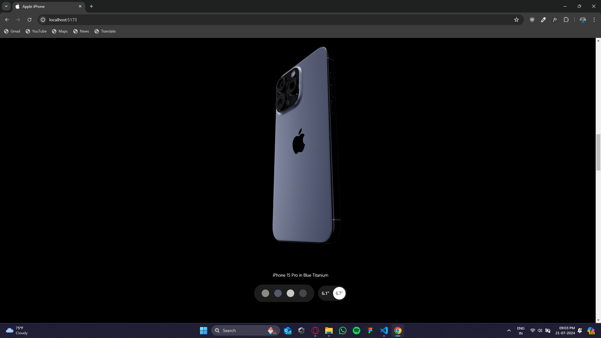

# Apple iPhone 15 website clone using Three.js and GSAP

## To run this project:
1. Install dependencies:
```
npm install
```
2. Run the project:
```
npm run dev
```

## Output Screens

 1. Hero Section
 
 2. Highlights Section
 
 3. 3D Model
 
 4. Other
 
